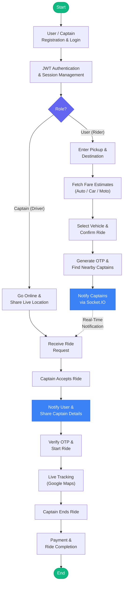

# Pushpak — Application Flow (Synopsis)

```mermaid
flowchart TD
    A(["Start"]) --> B["User / Captain\nRegistration & Login"]
    B --> C["JWT Authentication\n& Session Management"]
    C --> D{"Role?"}

    D -->|"User (Rider)"| E["Enter Pickup &\nDestination"]
    E --> F["Fetch Fare Estimates\n(Auto / Car / Moto)"]
    F --> G["Select Vehicle &\nConfirm Ride"]
    G --> H["Generate OTP &\nFind Nearby Captains"]
    H --> I["Notify Captains\nvia Socket.IO"]

    D -->|"Captain (Driver)"| J["Go Online &\nShare Live Location"]
    J --> K["Receive Ride\nRequest"]

    I -.->|"Real-Time\nNotification"| K
    K --> L["Captain Accepts Ride"]
    L --> M["Notify User &\nShare Captain Details"]
    M --> N["Verify OTP &\nStart Ride"]
    N --> O["Live Tracking\n(Google Maps)"]
    O --> P["Captain Ends Ride"]
    P --> Q["Payment &\nRide Completion"]
    Q --> R(["End"])

    style A fill:#10b981,stroke:#059669,color:#fff
    style R fill:#10b981,stroke:#059669,color:#fff
    style D fill:#6366f1,stroke:#4f46e5,color:#fff
    style I fill:#3b82f6,stroke:#2563eb,color:#fff
    style M fill:#3b82f6,stroke:#2563eb,color:#fff
```
