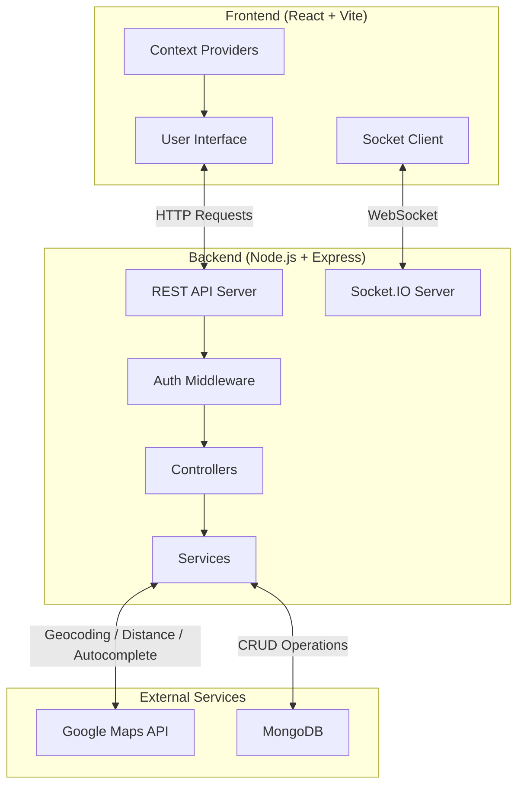
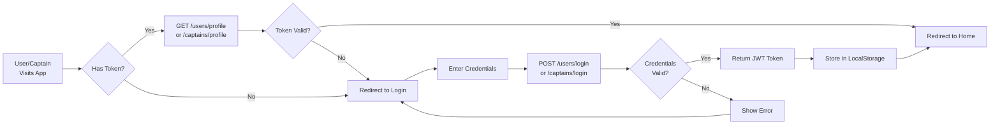
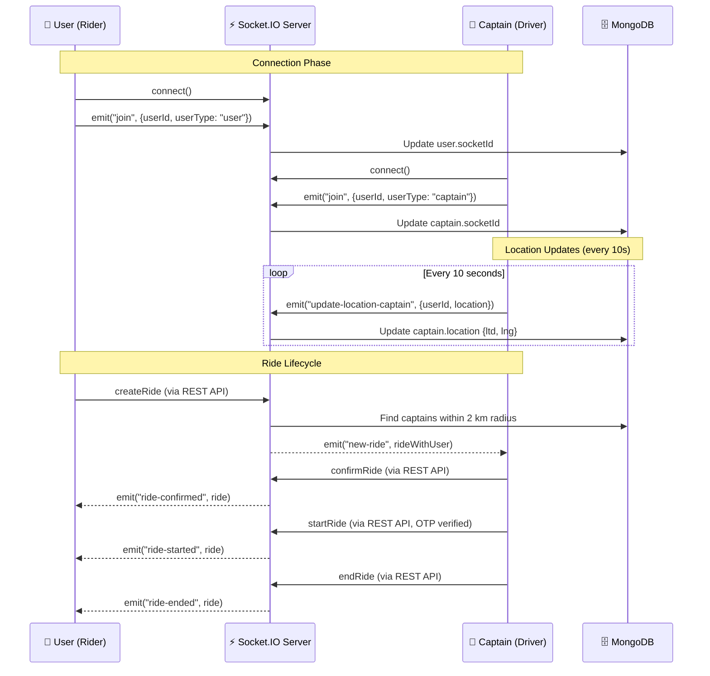
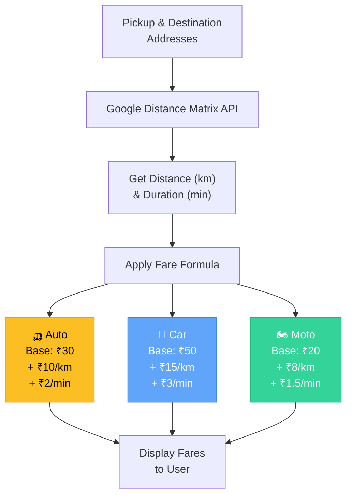
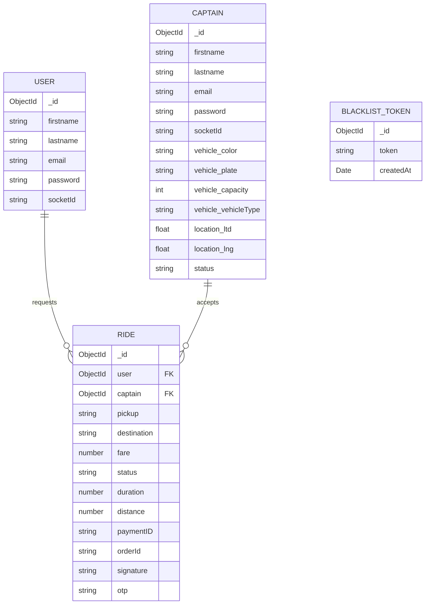
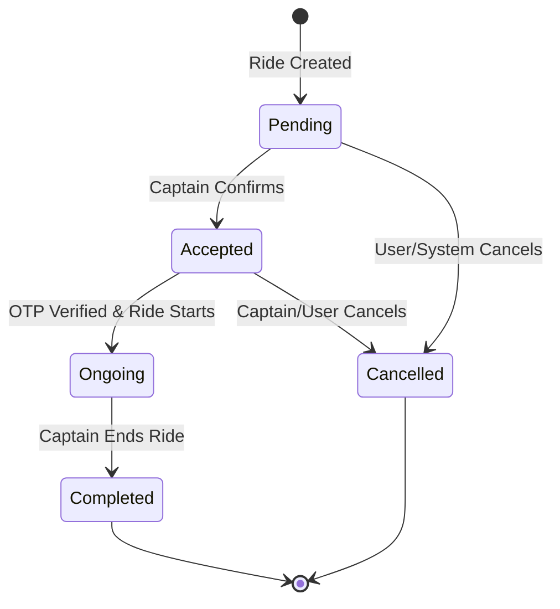

# Pushpak — Project Synopsis Flowchart

## 1. System Architecture Overview

---

## 2. Complete Application Flow

```mermaid
flowchart TD
    START(["🚀 Application Start"]) --> LANDING["Landing Page (Start)"]
    
    LANDING --> CHOICE{"Select Role"}
    
    %% ===== USER FLOW =====
    CHOICE -->|"User"| U_AUTH{"User Authenticated?"}
    U_AUTH -->|"No"| U_LOGIN["User Login / Signup"]
    U_LOGIN --> U_JWT["Generate JWT Token"]
    U_JWT --> U_STORE["Store Token in LocalStorage"]
    U_STORE --> U_HOME
    U_AUTH -->|"Yes"| U_HOME["User Home Page"]

    %% ===== CAPTAIN FLOW =====
    CHOICE -->|"Captain (Driver)"| C_AUTH{"Captain Authenticated?"}
    C_AUTH -->|"No"| C_LOGIN["Captain Login / Signup"]
    C_LOGIN --> C_JWT["Generate JWT Token"]
    C_JWT --> C_STORE["Store Token in LocalStorage"]
    C_STORE --> C_HOME
    C_AUTH -->|"Yes"| C_HOME["Captain Home Page"]

    %% ===== RIDE BOOKING FLOW (USER) =====
    U_HOME --> SOCKET_U["Connect Socket & Join Room"]
    SOCKET_U --> ENTER_LOC["Enter Pickup & Destination"]
    ENTER_LOC --> AUTOCOMPLETE["Fetch Location Suggestions\n(Google Places API)"]
    AUTOCOMPLETE --> SELECT_LOC["Select Locations"]
    SELECT_LOC --> FIND_TRIP["Click 'Find Trip'"]
    FIND_TRIP --> GET_FARE["GET /rides/get-fare"]
    GET_FARE --> CALC_FARE["Calculate Fare\n(Base + Per Km + Per Min)"]
    CALC_FARE --> SHOW_VEHICLES["Show Vehicle Options\n(Auto / Car / Moto)"]
    SHOW_VEHICLES --> SELECT_VEH["User Selects Vehicle Type"]
    SELECT_VEH --> CONFIRM_RIDE["Confirm Ride"]
    CONFIRM_RIDE --> CREATE_RIDE["POST /rides/create"]
    CREATE_RIDE --> GEN_OTP["Generate 6-digit OTP"]
    GEN_OTP --> SAVE_RIDE["Save Ride to MongoDB\n(status: pending)"]
    SAVE_RIDE --> GEOCODE["Geocode Pickup Address\n(Google Geocoding API)"]
    GEOCODE --> FIND_CAPTAINS["Find Captains in 2 km Radius"]
    FIND_CAPTAINS --> BROADCAST["Broadcast 'new-ride' via Socket\nto All Nearby Captains"]
    BROADCAST --> LOOKING["User sees:\n'Looking for Driver...'"]

    %% ===== CAPTAIN RECEIVES RIDE =====
    C_HOME --> SOCKET_C["Connect Socket & Join Room"]
    SOCKET_C --> UPDATE_LOC["Update Location Every 10s\n(GPS Coordinates via Socket)"]
    UPDATE_LOC --> WAIT_RIDE["Wait for Ride Requests"]
    BROADCAST -.->|"Socket: new-ride"| WAIT_RIDE
    WAIT_RIDE --> RIDE_POPUP["Show Ride Request Popup"]
    RIDE_POPUP --> CAP_DECISION{"Captain Decision"}
    CAP_DECISION -->|"Ignore"| WAIT_RIDE
    CAP_DECISION -->|"Accept"| ACCEPT_RIDE["POST /rides/confirm"]
    ACCEPT_RIDE --> UPDATE_STATUS_ACC["Update Ride Status\n(pending → accepted)"]
    UPDATE_STATUS_ACC --> NOTIFY_USER["Socket: 'ride-confirmed'\nto User"]
    NOTIFY_USER --> SHOW_OTP["Captain Sees OTP Input Screen"]

    %% ===== USER RECEIVES CONFIRMATION =====
    NOTIFY_USER -.->|"Socket: ride-confirmed"| LOOKING
    LOOKING --> DRIVER_ASSIGNED["User sees:\n'Driver Assigned'\n(Captain details shown)"]

    %% ===== RIDE START =====
    SHOW_OTP --> VERIFY_OTP["Captain Enters OTP\nGET /rides/start-ride"]
    VERIFY_OTP --> OTP_CHECK{"OTP Valid?"}
    OTP_CHECK -->|"No"| OTP_ERROR["Show Error:\n'Invalid OTP'"]
    OTP_ERROR --> SHOW_OTP
    OTP_CHECK -->|"Yes"| START_RIDE["Update Ride Status\n(accepted → ongoing)"]
    START_RIDE --> NOTIFY_START["Socket: 'ride-started'\nto User"]
    NOTIFY_START -.->|"Socket: ride-started"| DRIVER_ASSIGNED
    DRIVER_ASSIGNED --> RIDING_USER["User Riding Page\n(Live Tracking on Map)"]
    START_RIDE --> RIDING_CAP["Captain Riding Page\n(Live Tracking on Map)"]

    %% ===== RIDE END =====
    RIDING_CAP --> FINISH["Captain Clicks:\n'Complete Ride'"]
    FINISH --> END_RIDE["POST /rides/end-ride"]
    END_RIDE --> UPDATE_COMPLETE["Update Ride Status\n(ongoing → completed)"]
    UPDATE_COMPLETE --> NOTIFY_END["Socket: 'ride-ended'\nto User"]
    NOTIFY_END -.->|"Socket: ride-ended"| RIDING_USER
    RIDING_USER --> PAYMENT["User: Make Payment"]
    PAYMENT --> DONE(["✅ Ride Complete"])

    %% Styling
    style START fill:#10b981,stroke:#059669,color:#fff
    style DONE fill:#10b981,stroke:#059669,color:#fff
    style CHOICE fill:#6366f1,stroke:#4f46e5,color:#fff
    style CAP_DECISION fill:#6366f1,stroke:#4f46e5,color:#fff
    style OTP_CHECK fill:#6366f1,stroke:#4f46e5,color:#fff
    style U_AUTH fill:#f59e0b,stroke:#d97706,color:#fff
    style C_AUTH fill:#f59e0b,stroke:#d97706,color:#fff
    style BROADCAST fill:#ef4444,stroke:#dc2626,color:#fff
    style NOTIFY_USER fill:#3b82f6,stroke:#2563eb,color:#fff
    style NOTIFY_START fill:#3b82f6,stroke:#2563eb,color:#fff
    style NOTIFY_END fill:#3b82f6,stroke:#2563eb,color:#fff
```

---

## 3. User Authentication Flow

---

## 4. Real-Time Communication Flow (Socket.IO)

---

## 5. Fare Calculation Logic

---

## 6. Database Schema Overview

---

## 7. Technology Stack

| Layer | Technology |
|---|---|
| **Frontend** | React 18, Vite, React Router DOM |
| **Styling** | TailwindCSS |
| **Animations** | GSAP + @gsap/react |
| **Icons** | Remix Icon |
| **HTTP Client** | Axios |
| **Backend** | Node.js, Express.js |
| **Database** | MongoDB + Mongoose |
| **Authentication** | JWT (jsonwebtoken), bcrypt |
| **Real-Time** | Socket.IO |
| **Maps & Location** | Google Maps API (Geocoding, Distance Matrix, Places Autocomplete) |
| **State Management** | React Context API |

---

## 8. Ride Status Lifecycle

